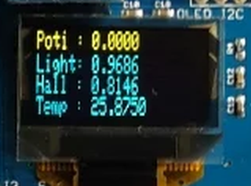

## OLED Display (auf SMD Shield)

- - -

Ein [LED-Display (von LED, englisch light-emitting diode, also „Leuchtdiodenanzeige“)](https://de.wikipedia.org/wiki/LED-Display) ist eine Anzeigevorrichtung auf Basis von Leuchtdioden.

LED-Anzeigen, welche aus organischen Leuchtdioden in Dünnschichttechnik auf einem gemeinsamen Substrat als integrierte Matrizen aufgebaut sind sogenannte [OLEDs.](http://www.buydisplay.com/default/oled-display?interface=461)

### Anwendungen 

*   Anzeige von Sensorwerten, Zeit, Einfache Grafiken etc.

### Links

*  [mbed OS V2 Variante](https://developer.mbed.org/teams/smdiotkit1ch/code/Sensoren/) 

