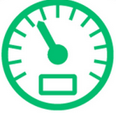

Zeit
----

- - -

Zeit ist eine wichtige Komponente in Computersystemen.

Sei es um Aktionen zu einer bestimmten Zeit auszulösen oder auch nur um Zeitkritische Abschnitte im Programmen zu finden.

### Beispiele

* [Real Time Clock](RTC/)
* [Ticker](Ticker/)
* [Timer](Timer/)