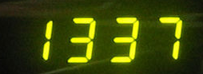
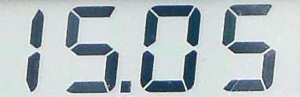
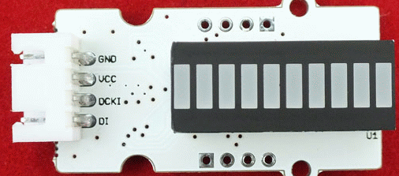
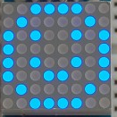

## User Interface

|  |  |  |  |
| --- | --- | --- | --- |
| LED Anzeige | LCD Anzeige | LED Bar | Dot LED Matrix |

- - -

Die Benutzerschnittstelle (User Interface) ist die Stelle oder Handlung, mit der ein Mensch mit einer Maschine in Kontakt tritt (Mensch-Maschine-Schnittstelle).

Diese kann durch eine LED Anzeige mit Ziffern erfolgen oder einfach durch das Blinken von LED&#039;s. So kann, z.B. eine Temperatur im Klartext auf einem Display oder durch aneinandergereihte LED dargestellt werden.

### Beispiele

* [LED](LEDUI/)
* [OLED Display](../i2c/Sensoren/)
* [DOT LED Matrix](../spi/DotLEDMatrix/)

### Glossary: LED und LCD

Die Abkürzung LED bedeutet im Deutschen so viel wie „Licht emittierende Diode“. LEDs sind Stromsparend und Langlebig, rund 150 Jahre.

Die Abkürzung LCD stammt aus dem Englischen und bedeutet „Liquid Crystal Display“. Gemeint sind Flüssigkristalle, deren Ausrichtung durch elektrische Impulse gesteuert wird.